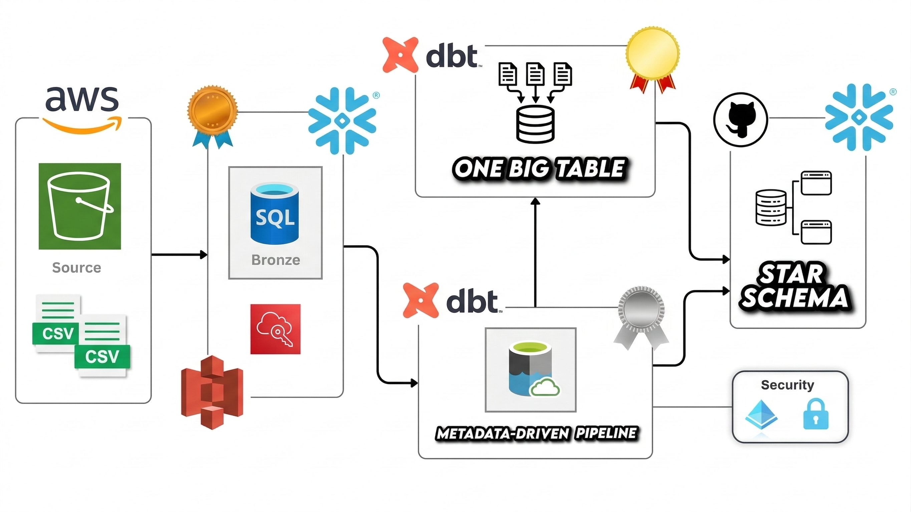

# Airbnb End-to-End Data Engineering Project

## Overview
This project implements a complete end-to-end data engineering pipeline for Airbnb data using modern cloud technologies. The solution demonstrates best practices in data warehousing, transformation, and analytics using Snowflake, dbt (Data Build Tool), and AWS.

The pipeline processes Airbnb listings, bookings, and hosts data through a medallion architecture (Bronze -> Silver -> Gold), with support for incremental processing and analytics-ready modeling.

## Architecture

### Architecture Diagram



### Data Flow
Source Data (CSV) -> AWS S3 -> Snowflake (Staging) -> Bronze Layer -> Silver Layer -> Gold Layer

### Technology Stack
- Cloud Data Warehouse: Snowflake
- Transformation Layer: dbt Core (`dbt-core`, `dbt-snowflake`)
- Cloud Storage: AWS S3 (ingestion pattern)
- Version Control: Git
- Python: 3.12+

### Key dbt Features
- Layered modeling (Bronze, Silver, Gold)
- Jinja templating
- Custom macros
- Tests and documentation artifacts
- Snapshot-ready project structure

## Data Model

### Bronze Layer (Raw Data)
- `bronze_bookings` - raw booking transactions
- `bronze_hosts` - raw host information
- `bronze_listings` - raw property listings

### Silver Layer (Cleaned Data)
- `silver_bookings` - validated booking records
- `silver_hosts` - cleaned and enriched host profiles
- `silver_listings` - standardized listing information

### Gold Layer (Analytics-Ready)
- `obt` - denormalized One Big Table for analytics
- `fact` - fact-style output model for downstream reporting

### Snapshots (SCD Type 2)
Snapshot configs are present for:
- `dim_bookings`
- `dim_hosts`
- `dim_listings`

## Project Structure

```text
AIRBNB/
|-- README.md
|-- pyproject.toml
|-- main.py
|-- SourceData/
|   |-- bookings.csv
|   |-- hosts.csv
|   `-- listings.csv
|-- DDL/
|   |-- ddl.sql
|   `-- resources.sql
`-- aws_dbt_snowflake_project/
		|-- dbt_project.yml
		|-- profiles.yml
		|-- models/
		|   |-- sources/
		|   |   `-- sources.yml
		|   |-- bronze/
		|   |   |-- bronze_bookings.sql
		|   |   |-- bronze_hosts.sql
		|   |   `-- bronze_listings.sql
		|   |-- silver/
		|   |   |-- silver_bookings.sql
		|   |   |-- silver_hosts.sql
		|   |   `-- silver_listings.sql
		|   `-- gold/
		|       |-- fact.sql
		|       |-- obt.sql
		|       `-- ephemeral/
		|           |-- bookings.sql
		|           |-- hosts.sql
		|           `-- listings.sql
		|-- macros/
		|   |-- generate_schema_name .sql
		|   |-- mulitply.sql
		|   |-- tag.sql
		|   `-- trimmer.sql
		|-- analyses/
		|   |-- explore.sql
		|   |-- IF_ELSE.sql
		|   `-- LOOP.sql
		|-- snapshots/
		|   |-- dim_bookings.yml
		|   |-- dim_hosts.yml
		|   `-- dim_listings.yml
		|-- tests/
		|   `-- source_tests.sql
		|-- seeds/
		`-- target/
```

## Getting Started

### Prerequisites
- Snowflake account
- AWS account (for S3-based ingestion flow)
- Python 3.12+

### Installation

```bash
git clone <repository-url>
cd AIRBNB
python -m venv .venv
.venv\Scripts\Activate.ps1
python -m pip install -e .
```

Alternative with `uv`:

```bash
uv sync
```

### Core Dependencies
- `dbt-core>=1.11.6`
- `dbt-snowflake>=1.11.2`

### Configure Snowflake Connection
Recommended: use `~/.dbt/profiles.yml` with environment variables.

```yaml
aws_dbt_snowflake_project:
	outputs:
		dev:
			type: snowflake
			account: "{{ env_var('SNOWFLAKE_ACCOUNT') }}"
			user: "{{ env_var('SNOWFLAKE_USER') }}"
			password: "{{ env_var('SNOWFLAKE_PASSWORD') }}"
			role: "{{ env_var('SNOWFLAKE_ROLE') }}"
			warehouse: "{{ env_var('SNOWFLAKE_WAREHOUSE') }}"
			database: "{{ env_var('SNOWFLAKE_DATABASE') }}"
			schema: "{{ env_var('SNOWFLAKE_SCHEMA') }}"
			threads: 4
	target: dev
```

### Set Up Snowflake Database
Run SQL from `DDL/ddl.sql` to create required staging objects.

### Load Source Data
Load CSV files from `SourceData/` to Snowflake staging tables:
- `bookings.csv` -> `AIRBNB.STAGING.BOOKINGS`
- `hosts.csv` -> `AIRBNB.STAGING.HOSTS`
- `listings.csv` -> `AIRBNB.STAGING.LISTINGS`

## Usage

### Test Connection

```bash
uv run dbt debug --project-dir aws_dbt_snowflake_project --profiles-dir aws_dbt_snowflake_project
```

### Install dbt Packages

```bash
uv run dbt deps --project-dir aws_dbt_snowflake_project --profiles-dir aws_dbt_snowflake_project
```

### Run All Models

```bash
uv run dbt run --project-dir aws_dbt_snowflake_project --profiles-dir aws_dbt_snowflake_project
```

### Run Specific Layer

```bash
uv run dbt run --project-dir aws_dbt_snowflake_project --profiles-dir aws_dbt_snowflake_project --select bronze.*
uv run dbt run --project-dir aws_dbt_snowflake_project --profiles-dir aws_dbt_snowflake_project --select silver.*
uv run dbt run --project-dir aws_dbt_snowflake_project --profiles-dir aws_dbt_snowflake_project --select gold.*
```

### Run Tests

```bash
uv run dbt test --project-dir aws_dbt_snowflake_project --profiles-dir aws_dbt_snowflake_project
```

### Run Snapshots

```bash
uv run dbt snapshot --project-dir aws_dbt_snowflake_project --profiles-dir aws_dbt_snowflake_project
```

### Generate Documentation

```bash
uv run dbt docs generate --project-dir aws_dbt_snowflake_project --profiles-dir aws_dbt_snowflake_project
uv run dbt docs serve --project-dir aws_dbt_snowflake_project --profiles-dir aws_dbt_snowflake_project
```

### Build Everything

```bash
uv run dbt build --project-dir aws_dbt_snowflake_project --profiles-dir aws_dbt_snowflake_project
```

## Key Features

### 1. Incremental Loading Pattern
Use dbt incremental materialization for efficient processing of new or changed records.

```sql
{{ config(materialized='incremental') }}

	where created_at > (
		select coalesce(max(created_at), '1900-01-01') from {{ this }}
	)

```

### 2. Custom Macros
Reusable macro logic is available in `aws_dbt_snowflake_project/macros/`.

Example:

```sql
{{ tag('cast(price_per_night as int)') }} as price_per_night_tag
```

### 3. Dynamic SQL Generation
The OBT model uses Jinja loops for maintainable SQL generation.

### 4. Slowly Changing Dimensions (SCD Type 2)
Snapshot configs are included to support historical tracking with valid-from/valid-to style metadata.

### 5. Schema Organization
Configured in `dbt_project.yml`:
- Bronze models -> `AIRBNB.BRONZE.*`
- Silver models -> `AIRBNB.SILVER.*`
- Gold models -> `AIRBNB.GOLD.*`

## Data Quality

### Testing Strategy
- Source-level validation
- Uniqueness and nullability checks
- Referential integrity and business-rule testing (extend via schema/tests)

### Data Lineage
dbt lineage provides:
- upstream dependencies
- downstream impact visibility
- source-to-consumption traceability

## Security and Best Practices

### Credentials Management
- never commit credentials in `profiles.yml`
- use environment variables for secrets
- implement RBAC in Snowflake

### Code Quality
- format SQL consistently
- version control with Git
- review model changes before merge

### Performance
- prefer incremental models for large tables
- use ephemeral/intermediate logic where beneficial
- optimize Snowflake tables for query patterns

## Additional Resources
- dbt docs: https://docs.getdbt.com/
- Snowflake docs: https://docs.snowflake.com/
- dbt best practices: https://docs.getdbt.com/guides/best-practices

## Contributing
1. Fork the repository.
2. Create a feature branch: `git checkout -b feature/AmazingFeature`.
3. Commit changes: `git commit -m "Add AmazingFeature"`.
4. Push your branch: `git push origin feature/AmazingFeature`.
5. Open a pull request.

## License
This project is part of a data engineering portfolio demonstration.

## Author
Project: Airbnb Data Engineering Pipeline  
Technologies: Snowflake, dbt, AWS, Python

## Troubleshooting

### Connection Errors
- verify Snowflake credentials and profile target
- ensure network access and running warehouse
- run `dbt debug`

### Compilation Errors
- run `dbt debug` and `dbt compile`
- verify refs/sources and Jinja syntax

### Incremental Load Issues
- run with `--full-refresh` when needed
- validate timestamp logic used in incremental filters

## Future Enhancements
- Add data quality dashboards
- Implement CI/CD pipeline
- Add more business metrics
- Integrate BI tools (Power BI/Tableau)
- Add alerting and monitoring
- Implement data masking for PII
- Expand automated testing coverage


# Airbnb-AWS-DBT-Snowflake
